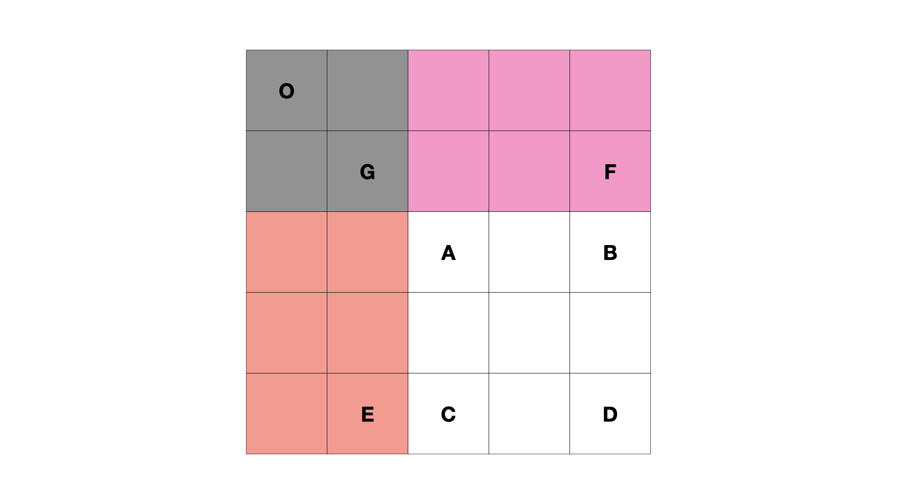

# 题目

> [链接地址](https://leetcode-cn.com/problems/range-sum-query-2d-immutable/)
>

给定一个二维矩阵 `matrix`，以下类型的多个请求：

* 计算其子矩形范围内元素的总和，该子矩阵的 **左上角** 为 `(row1, col1)` ，**右下角** 为 `(row2, col2)` 。

实现 `NumMatrix` 类：

* `NumMatrix(int[][] matrix)` 给定整数矩阵 `matrix` 进行初始化
* `int sumRegion(int row1, int col1, int row2, int col2)` 返回 **左上角** `(row1, col1)` 、**右下角** `(row2, col2)` 所描述的子矩阵的元素 **总和** 。

**示例 1：**


```
输入: 
["NumMatrix","sumRegion","sumRegion","sumRegion"]
[[[[3,0,1,4,2],[5,6,3,2,1],[1,2,0,1,5],[4,1,0,1,7],[1,0,3,0,5]]],[2,1,4,3],[1,1,2,2],[1,2,2,4]]
输出: 
[null, 8, 11, 12]

解释:
NumMatrix numMatrix = new NumMatrix([[3,0,1,4,2],[5,6,3,2,1],[1,2,0,1,5],[4,1,0,1,7],[1,0,3,0,5]]]);
numMatrix.sumRegion(2, 1, 4, 3); // return 8 (红色矩形框的元素总和)
numMatrix.sumRegion(1, 1, 2, 2); // return 11 (绿色矩形框的元素总和)
numMatrix.sumRegion(1, 2, 2, 4); // return 12 (蓝色矩形框的元素总和)
```

# 题解

```java
class NumMatrix {
    int[][] prefix;

    public NumMatrix(int[][] matrix) {
        int rowLength = matrix.length;
        int colLength = matrix[0].length;
        prefix = new int[rowLength + 1][colLength + 1];
        for (int i = 0; i < rowLength; i++) {
            for (int j = 0; j < colLength; j++) {
                prefix[i + 1][j + 1] = prefix[i][j + 1] + prefix[i + 1][j] - prefix[i][j] + matrix[i][j];
            }
        }
        for (int[] is : prefix) {
            System.out.println(Arrays.toString(is));
        }

    }

    public int sumRegion(int row1, int col1, int row2, int col2) {
        return prefix[row2 + 1][col2 + 1] - prefix[row2 + 1][col1] - prefix[row1][col2 + 1] + prefix[row1][col1];
    }
}
```

# 思路

* 计算前缀和
  
  preSum[i][j]=preSum[i−1][j]+preSum[i][j−1]−preSum[i−1][j−1]+matrix[i][j]
* 根据前缀和就子面积
  
  preSum[row2][col2]−preSum[row2][col1−1]−preSum[row1−1][col2]+preSum[row1−1][col1−1]

# 参考文档

[https://leetcode-cn.com/problems/range-sum-query-2d-immutable/solution/ru-he-qiu-er-wei-de-qian-zhui-he-yi-ji-y-6c21/](https://leetcode-cn.com/problems/range-sum-query-2d-immutable/solution/ru-he-qiu-er-wei-de-qian-zhui-he-yi-ji-y-6c21/)