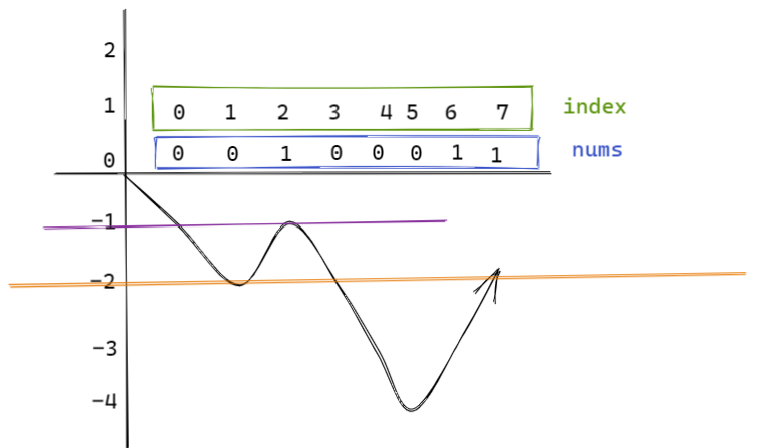

# 题目

> [链接地址](https://leetcode-cn.com/problems/contiguous-array/)
>

给定一个二进制数组 `nums` , 找到含有相同数量的 `0` 和 `1` 的最长连续子数组，并返回该子数组的长度。

**示例 1:**

```
输入: nums = [0,1]
输出: 2
说明: [0, 1] 是具有相同数量 0 和 1 的最长连续子数组。
```

**示例 2:**

```
输入: nums = [0,1,0]
输出: 2
说明: [0, 1] (或 [1, 0]) 是具有相同数量0和1的最长连续子数组。
```

# 题解

```java
class Solution {
    /**
     * 遇到0 sum-1 遇到1 sum+1。如果有一段前缀和相等，则说明0 1个数相等。
     * 
     * @param nums
     * @return
     */
    public int findMaxLength(int[] nums) {
        Map<Integer, Integer> map = new HashMap<>(); // key为当前元素的前缀和，value为当前index,如果两个sum相同，则说明该段0和1的个数相同
        map.put(0, -1); // 初始化index 为 -1的前缀和
        int preSum = 0; // 前缀和
        int maxLength = 0; // 前缀和相等的最长一段
        for (int i = 0; i < nums.length; i++) {
            if (nums[i] == 1) {
                preSum++;
            } else {
                preSum--;
            }
            // 检测是否有与当前位置的前缀和相等的
            if (map.containsKey(preSum)) {
                int index = map.get(preSum); // i 与 index 的前缀和相等，从index - i的这一段0、1个数相等
                maxLength = Math.max(maxLength, i - index);
            } else {
                map.put(preSum, i); // 没有与当前位置的前缀和一样的，说明从开始到当下没有0 1 个数相等的，0多一些或者1多一些
            }
        }
        return maxLength;
    }
}
```

# 思路

使用前缀和的思想，0 前缀和 -1，1前缀和+1，如果两个index的前缀和相等，则说明这两个区间的 0 1 个数相等



# 参考文档

[https://leetcode-cn.com/problems/contiguous-array/solution/lian-xu-shu-zu-qian-zhui-he-ha-xi-biao-b-srnp/](https://leetcode-cn.com/problems/contiguous-array/solution/lian-xu-shu-zu-qian-zhui-he-ha-xi-biao-b-srnp/)